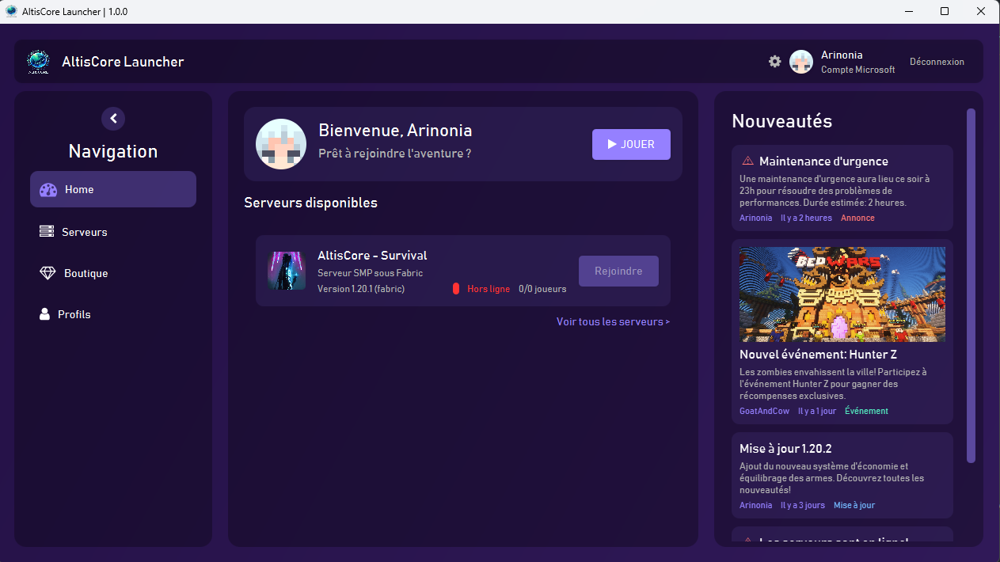
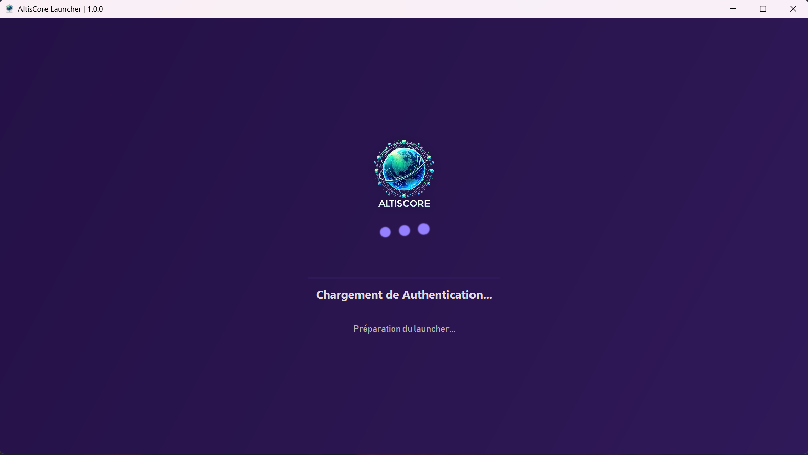

# AltisCore Launcher 🚀

[](https://www.oracle.com/java/)
[](https://openjfx.io/)
[](LICENSE)
[](https://gradle.org)

A modern and sleek Minecraft launcher built with JavaFX, designed specifically for managing Minecraft events and multiplayer servers.



## ✨ Features

- **Modern User Interface**: Clean and intuitive design with smooth animations
- **Server Management**: "Real-time" server status monitoring and easy access
- **Authentication System**: Microsoft authentication and profile management
- **Resource Management**: Efficient handling of game files and updates
- **Settings Customization**: Flexible options for Java runtime and memory allocation
- **Multi-Server Support**: Connect to various game modes and events seamlessly

## 🖼️ Screenshots

<details>
<summary>Click to view screenshots</summary>

### Loading Screen


### Home Panel


### Settings Panel


</details>

## 🚀 Getting Started

### Prerequisites

- Java Development Kit (JDK) 21 or higher
- Gradle 8.5 or higher
- JavaFX 21

### Installation

1. Clone the repository:
```bash
git clone https://github.com/Arinonia/altiscore-launcher.git
```

2. Navigate to the project directory:
```bash
cd altiscore-launcher
```

3. Build the project:
```bash
gradle build
```

4. Run the launcher:
```bash
gradle run
```

## 🛠️ Development

### Building from Source

1. Make sure you have JDK 21 and Gradle installed
2. Clone the repository
3. Run `gradle build`

The built artifact will be located in `build/libs/`

## 🤝 Contributing

Contributions are welcome! Here's how you can help:

1. Fork the repository
2. Create a feature branch: `git checkout -b new-feature`
3. Commit your changes: `git commit -am 'Add new feature'`
4. Push to the branch: `git push origin new-feature`
5. Submit a pull request

## 📝 License

This project is licensed under the MIT License - see the [LICENSE](LICENSE.md) file for details.

## 📞 Contact

- Discord: [Join our community](https://discord.gg/Xut47pGAXC)
- Email: arinonia.dev@gmail.com

---
Made with ❤️ by Arinonia